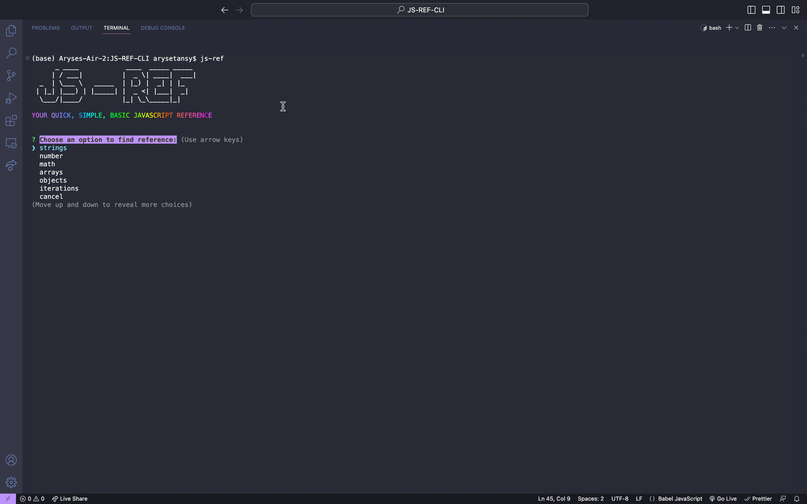
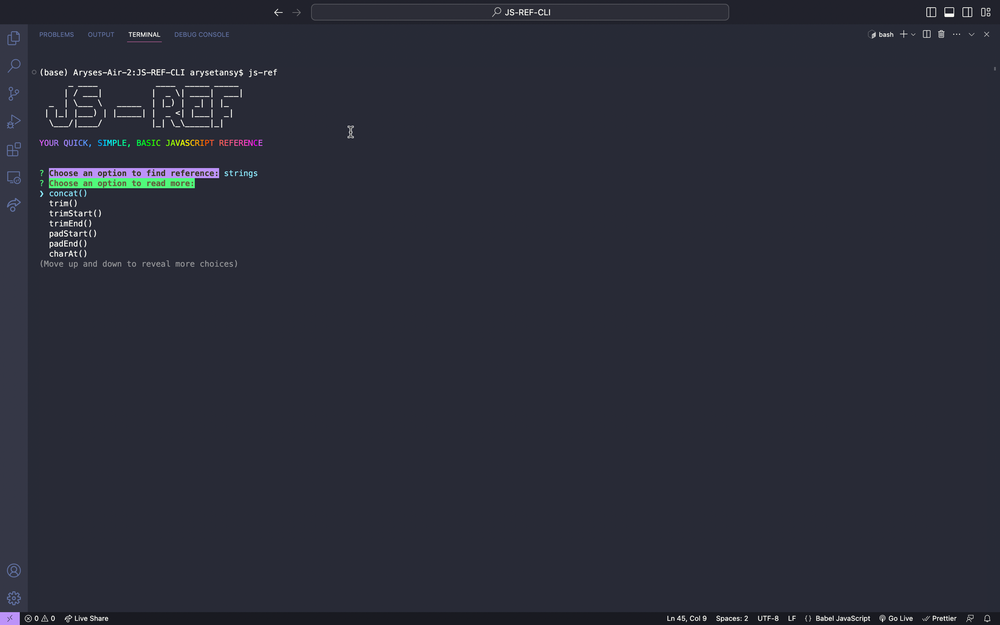
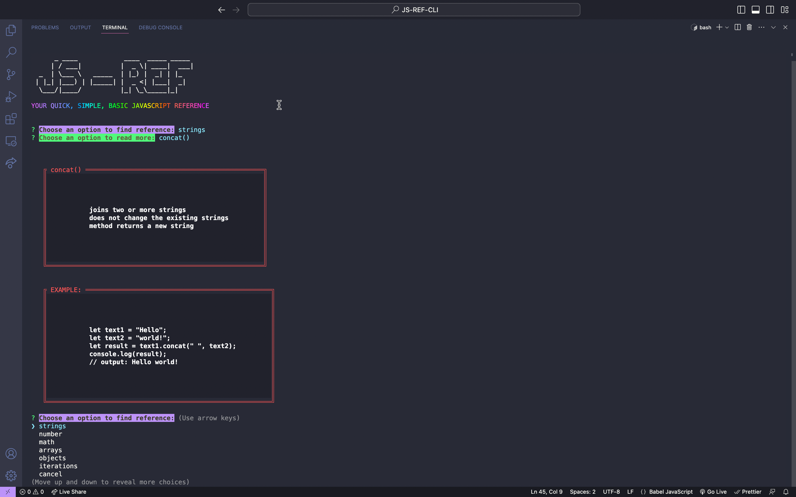

# DIDACTIC-JS

CLI Tool to assist with finding quick JavaScript methods and properties along with very didadatic examples. The Objective is to keep it accurate and descriptive yet as simple as possible for the users to get their reference.

> V1 not yet deployed to NPM, expected release will be only after the basic data types are complete.

## GALLERY

## THIS IS AN OPEN SOURCE INITIATIVE!

Would you like to contribute? Please refer to [contribute.md](CONTRIBUTE.md) to see how to proceed about it. We welcome all levels of developers.

## GETTING IT GOING

1. Fork this repo
2. Clone your forked version
3. run `npm install` at the root to install dependencies
4. run `npm i -g` at the root to install the tool
   > PS: If on MAC: `sudo npm i -g` which will prompt you to enter your mac password
5. The Tool is now installed, and you can initiate it by running `didactic-js` in any terminal (project does not need to be opened)
